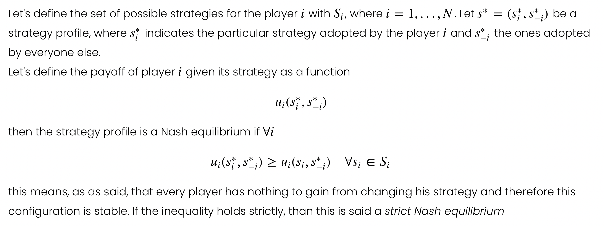

# Introduzione
I giochi vengono classificati in base alla loro struttura:
- successione dei turni:
  - Giochi in forma normale (o giochi strategici) : i giocatori compiono una sola azione e lo fanno contemporaneamente. Vengono rappresentati tramite matrici che indicano la scelta di un giocatore sulla base delle scelte degli altri.
  - Giochi in forma estensiva: partecipa in modo sequenziale, rappresentato tramite albero, dove vengono indicate le possibilità dei giocatori quando tocca a loro. 
- informazioni a disposizione dei giocatori:
  - informazione perfetta: conoscono tutto
  - informazione imperfetta: non conosce le scelte dei suoi avversari o anche da se stesso 
  - informazione incompleta: l'incompletezza è relativa alla informazioni sulle regole del gioco (per esempio, non conoscono la matrice completa)

I giochi comprendono giocatori che devono scegliere delle strategie di gioco tra quelle disponibili sulla base delle info proprie e di quelle degli altri giocatori, sulla base di una certa $\textbf{funzione di utilità}$.

Il risultato finale dipende anche dalle scelte degli altri giocatori.

## Cos'è una soluzione

Una volta che si dispone della modellazione di un gioco quello che si vuole individuare una soluzione o equilibrio del gioco.

L'interpretazione è di:
- stato stabile: descrivere la regolarità di una famiglia di situazioni simili. Ogni partecipante “conosce” quale sia l’equilibrio e  verifica  l’ottimalit`a  del  suo  comportamento  data  questa  conoscenza  che  ha acquisito dalla sua lunga esperienza.
- deduttiva: tratta un gioco in maniera isolata e cerca di capire quali restrizioni sul risultato finale impone la razionalità dei giocatori. Questa interpretazione assume che i giocatori deducano come gli avversari si comporteranno semplicemente tramite i principi della razionalità.

# Giochi strategici

## Gioco strategico con preferenze ordinali

Nei giochi  strategici i partecipanti effettuano le loro scelte in maniera totalmente indipendente dagli altri senza sapere cosa faranno i propri avversari. Effettuata la scelta tutti i giocatori compiono l’azione che hanno deciso.
Ogni giocatore possiede una certa relazione di preferenza su tutti i possibili risultati di un gioco che vengono generati dalle azioni che ognuno sceglie. 

Un  gioco  strategico  con  preferenze  ordinali  è un  gioco  composto da:

- l’insieme $N$ dei giocatori che vi prendono parte;
- per ogni giocatore $i \in N$ l’insieme $S_i$ di azioni per lui ammissibili;
- per ogni giocatore $i \in N$ la  sua  relazione  di  preferenza  $\succsim_i$  sull’insieme dei  profili  di  azioni  $S  ≡ ×_{j∈N} S_j$ . Questa  è  una  relazione  binaria  completa, transitiva e riflessiva. Equivalentemente, invece della relazione di preferenza,  la  funzione  di  utilità  $u_i : S  → R$  che  indica  le  preferenze  del giocatore $i$ sull’insieme dei profili di azioni.

### Equilibrio di Nash

è un set di strategie, una per ogni giocatore, tali che ogni giocatore non ha incentivo a cambiare la propria date le azioni degli altri giocatori

### Definizione 

In un gioco strategico con preferenze ordinali il profilo di azioni $s^*$ è un equilibrio di Nash se per ogni giocatore $\textit{i}$ ed ogni sua azione $s_i$, $s^*$ è altrettanto buono quanto il profilo di azioni $(s_i,s^*_{-i})$ rispetto alle preferenze di $i$ . Equivalentemente:

$$ u_i(s^*) \geq u_i(s_i,s^*_{-i}), \forall s_i \in S_i, \forall i \in N $$

Ovvero, la scelta di i è migliore rispetto a qualsiasi scelta presa dagli avversari. Nel gioco del progioniero

|                | Confess  | Don't confess | 
| -------------- | -------- | ------------- |
| Confess        |  -3,-3   | 0, -4         |
| Don't Confess  |  -4,0    | -1,-1         |

 
In questo caso, se il primo prigioniero (vale anche per il secondo) confessasse, potrebbe avere
        -3, 0
Se invece non confessasse
        -4, -1
Notiamo che, quindi, l'equilibrio di nash è qui il confessare per entrambi. Difatti, nel caso in cui non confessasse potrebbe ricevere 4 anni di prigione, mentre la scelta di confessare garantisce, indipendentemente dalla scelta dell'avversario, il migliore risultato.

Un'ulteriore definizione:

### Ulteriore definizione di equilibrio di Nash

Per qualsiasi profilo di azioni attuato dagli avversari del giocatore $i$, $s_{-i} \in S_{-i}$, definiamo tramite $B_i(s_{-i})$ la funzione best response come l'insieme delle migliori risposte che il giocatore i può adoperare dato il comportamento dei suoi avversari:

$$B_i(s_{-i}) \equiv {s_i \in S_i : u_i(s_i,s_{-i}) \ge u_i(s^{'}_i,s_{-i}), \forall s^{'}_i \in S_i }$$

L'equilirio di Nash può essere perciò definito come: in un gioco strategico con preferenze ordinali il profilo di azioni $s^*$ è un equilibrio di Nash se:

$$s^*_i \in B_i(s^*_{-i}, \forall i \in N$$

Ovvero, se ogni giocatore risponde nel modo migliore delle azioni intraprese dai suoi avversari.

## Strategie miste

Nel momento in cui ai giocatori è possibile randomizzare le proprie scelte, l'uso di: $\succsim_i$ e $u_i(\cdot)$ non basta, serve introdurre il concetto di $lotteria$.

Tra scelte e conseguenze spesso vi è una relazione stocastica. Questo vuol dire, che spesso ci si trova nello stesso rapporto tra biglietto di una lotteria e premio della stessa. La scelta da effetttuare consiste nel prendere il biglietto della lotteria, ma non è detto che andremo a ottenere il premio.

Indicando i premi con $Z$, possiamo supporre esista una distribuzione di probabilità su $Z$, ovvvero, esiste una funzione $p(z)$ con $z\in Z$ che, dato un premio ci dice quanto questo sarà probabile. 

Indichiamo con $\Delta(Z)$ l'insieme di tutte le distribuzioni di probabilità su $Z$.
Possiamo definire il concetto di utilità attesa $U(\cdot)$, per ogni premio un valore $v(z)$ viene associato. 

Quindi, un giocatiore preferisce una lotteria p a una lotteria q ($p \succsim q$) se:

$$U(p) \equiv \sum_{z\in Z} p(z)v(z) \ge U(q) \equiv  \sum_{z\in Z} q(z)v(z) $$

v è una funzione di utilità

